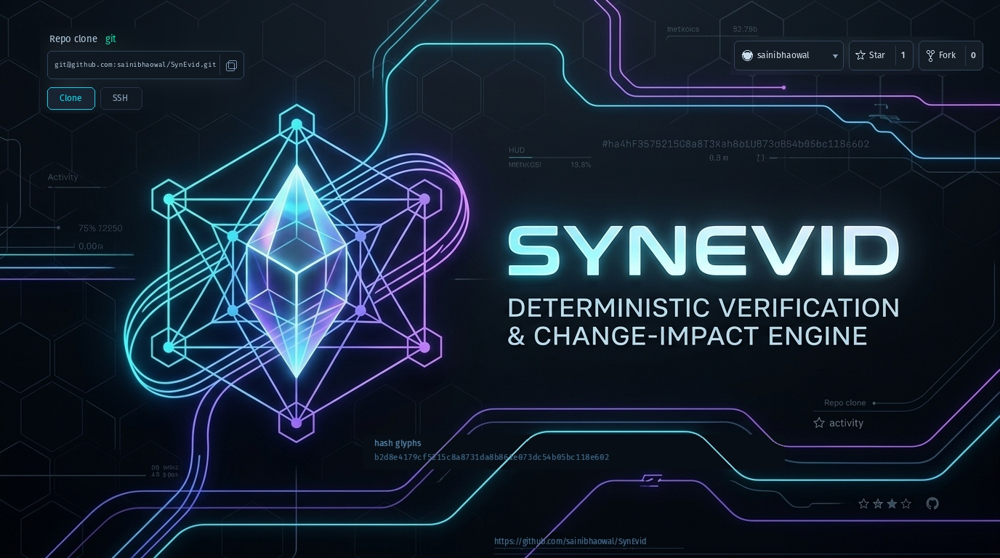
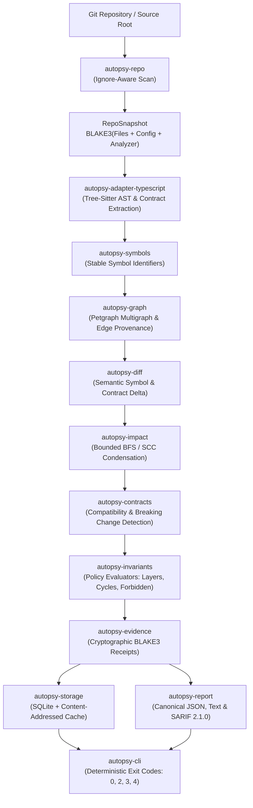
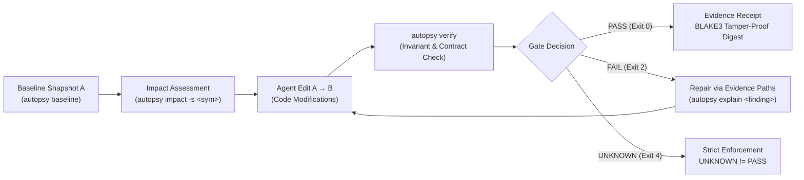
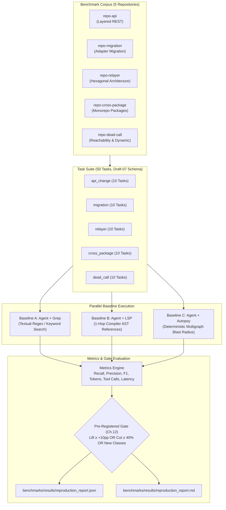

<p align="center">
  <a href="https://github.com/sainibhaowal/SynEvid">
    
  </a>
</p>

<h1 align="center">SynEvid</h1>

<p align="center">
  <strong>Deterministic Software Verification & Change-Impact Engine</strong><br>
  <em>Offline Ground-Truth Verification for Autonomous AI Coding Agents & Safety-Critical Systems</em>
</p>

<p align="center">
  <a href="https://github.com/sainibhaowal/SynEvid">
    
  </a>
</p>

<p align="center">
  <a href="https://github.com/sainibhaowal/SynEvid/stargazers"></a>
  <a href="https://github.com/sainibhaowal/SynEvid/network/members"></a>
  <a href="LICENSE"></a>
  <a href="SECURITY.md"></a>
  <a href="#deterministic-pipeline"></a>
  <a href="#hard-boundaries"></a>
  <a href="#quality-matrix"></a>
  <a href="#test-coverage"></a>
  <a href="#7-benchmark-harness--empirical-evaluation-architecture"></a>
</p>

---

## 1. Overview & Core Philosophy

**SynEvid** (internally known as *Code Autopsy*) is an offline, mathematically deterministic software verification and change-impact engine.

### What SynEvid Is
SynEvid is **not** a chatbot, code synthesizer, or LLM wrapper. It is a forensic verification oracle engineered in Rust to calculate exact semantic blast radius, enforce architectural invariants, and generate verifiable cryptographic evidence receipts across code revisions.

Frontier AI coding agents (Claude, Codex, Gemini, Cursor) produce non-deterministic proposals and cannot reliably self-verify subtle architectural regressions. SynEvid acts as their external, deterministic verification ground truth:

$$\text{Baseline Snapshot } A \xrightarrow[\text{Impact Query}]{\text{Blast Radius}} \text{Agent Edit } A \to B \xrightarrow[\text{Invariant Check}]{\text{Verify}} \text{Pass / Evidence Receipt}$$

---

## 2. Hard Boundaries & Invariants

SynEvid enforces strict architectural axioms (governed by [`AGENTS.md`](AGENTS.md) and [`docs/requirements/TRACEABILITY.md`](docs/requirements/TRACEABILITY.md)):

* **Zero LLM in Correctness Crates:** The core engine (`crates/*`) never imports or calls LLM APIs. Invariants, graph traversals, and contract checks are 100% deterministic code.
* **100/100 Deterministic Repeatability (NFR-001, FR-028):** Every run on identical inputs produces byte-identical BLAKE3 digests. No timestamps or unordered hash-map iterations exist in canonical serialization paths (strictly using `BTreeMap` and `BTreeSet`).
* **Read-Only Analyzer Engine (FR-026):** Commands strictly inspect repository state and change deltas; they **never mutate source code or git history**.
* **Honest Semantic Coverage (FR-014, FR-030):** Unsupported or dynamic constructs (reflection, dynamic imports, generated code) emit explicit `CoverageState::Unknown` or `Partial`. **`UNKNOWN` never collapses into `PASS`**.
* **Clean Architectural Inversion (`ARCH_NO_CORE_TO_MCP`):** Presentation, GUI, and MCP layers depend on core public interfaces, never the reverse.

---

## 3. Deterministic Pipeline Architecture

### A. Core Verification Engine Flow (Phases 0–5)



### B. Agent In-Session Verification Lifecycle Protocol (4.1 Ch.4.2)



---

## 4. Foundation Command Interface

```bash
# Snapshot repository baseline state into SQLite & content-addressed cache
autopsy baseline --format json

# Compute semantic change-set between snapshots or against worktree
autopsy diff --before <snapshot_id> --after <snapshot_id> --format json

# Traverse bounded blast radius for a symbol with ranked shortest paths
autopsy impact -s "src/index.ts::main" --direction forward --max-depth 5

# Verify architectural policies and contract compatibility (exit: 0 pass, 2 fail, 4 unknown)
autopsy verify --strict --invariants-file .autopsy/invariants.yml

# Trace exact evidence derivation, line spans, and paths for a finding
autopsy explain <finding_id>

# Run environment, storage integrity, adapter, and offline diagnostics
autopsy doctor

# Print engine version and adapter capabilities
autopsy version
```

---

## 5. Monorepo Crate Structure

```
SynEvid/
├── crates/
│   ├── autopsy-domain/             # Core typed IDs, entities, BTreeMap canonical models
│   ├── autopsy-repo/               # Discovery, ignore rules, BLAKE3 digest computation
│   ├── autopsy-adapter-api/        # Extensible language AST & symbol parser traits
│   ├── autopsy-adapter-typescript/ # TypeScript AST compiler & tree-sitter bridge
│   ├── autopsy-symbols/            # Stable symbol identities across line shifts
│   ├── autopsy-graph/              # Petgraph-backed typed multigraph with edge provenance
│   ├── autopsy-diff/               # Semantic symbol, edge, and contract deltas
│   ├── autopsy-impact/             # Bounded traversal, SCC cycle condensation, ranking
│   ├── autopsy-contracts/          # Callable/interface normalized contract models
│   ├── autopsy-invariants/         # Invariant YAML evaluators (layers, cycles, forbidden)
│   ├── autopsy-evidence/           # Verifiable finding receipts & path sequences
│   ├── autopsy-storage/            # SQLite & content-addressed local disk cache
│   ├── autopsy-report/             # Canonical JSON, human text & SARIF reporting
│   └── autopsy-cli/                # Deterministic CLI binary entrypoint
├── benchmarks/                     # Phase 6 Enterprise Benchmark Evaluation Harness
│   ├── corpus/                     # 5 TypeScript target repositories (repo-api, migration, relayer, etc.)
│   ├── tasks/                      # 50 task definitions strictly matching benchmark-task.schema.json
│   ├── engine/                     # Baselines A (grep), B (LSP), C (autopsy), metrics & gate evaluator
│   ├── results/                    # Committed reproduction reports (reproduction_report.json / .md)
│   ├── generate_tasks.py           # Deterministic task generation engine
│   └── run_benchmarks.py           # Executable benchmark CLI harness
├── apps/
│   ├── mcp-server/                 # Model Context Protocol adapter (read-only)
│   └── web-inspector/              # Local evidence & dependency graph inspector
├── tests/                          # End-to-end integration test harness (autopsy-tests)
├── schemas/                        # Frozen public JSON Schemas (Draft-07)
├── scripts/                        # Automated verification & determinism gates
├── docs/                           # Architecture, ADRs, Traceability, and Evidence records
└── assets/                         # Visual emblems, diagrams, and identity assets
```

---

## 6. Verification Quality Matrix & Pre-Commit Enforcement

SynEvid maintains a zero-tolerance policy for compiler warnings, test regressions, and non-deterministic behavior.

### Automated Pre-Commit Stack (8 Local Hooks)
All commits and pushes are verified locally via `.pre-commit-config.yaml`:
```bash
$ pre-commit run --all-files

Rust Format Check (rustfmt).................................Passed
Rust Clippy Strict Lints (-D warnings)......................Passed
Workspace Test Stack (Unit & Integration)...................Passed
Rust Documentation Tests....................................Passed
Golden 100-Run Determinism Invariant........................Passed
JSON Schema Syntactic Validation............................Passed
Engine Config & Invariant Syntax Validation.................Passed
Architectural Boundary Gate (Zero LLM/MCP in Core Crates)...Passed
```

### GitHub Actions Pre-Merge Gate
Every pull request and push to `main` executes a multi-job verification matrix ([`.github/workflows/ci.yml`](.github/workflows/ci.yml)):
1. **`rust-quality`**: `cargo fmt` + `cargo clippy --workspace --all-targets -- -D warnings`
2. **`rust-tests`**: 87 unit and integration tests across all crates (Phases 0, 1, 2, 3, 4, 5, 6)
3. **`determinism-gate`**: 100 sequential runs asserting byte-identical snapshot digests
4. **`arch-boundary-gate`**: Asserts core crates contain no LLM or presentation dependencies
5. **`schemas-and-configs`**: Validates JSON Schemas and engine TOML/YAML files
6. **`pre-merge-verification-gate`**: Aggregated status check gating merges

---

## 7. Benchmark Harness & Empirical Evaluation Architecture (FR-025, UC-08, RQ1–RQ5)

Phase 6 introduces a rigorous, offline benchmark evaluation suite comparing autonomous agent change-impact strategies across 50 realistic tasks and 5 TypeScript repositories:

### A. Benchmark Evaluation Architecture



### B. Comparative Empirical Telemetry (50 Tasks Across 5 Repositories)

| Metric | Baseline A (Agent + Grep) | Baseline B (Agent + LSP) | Baseline C (Agent + Autopsy) | Autopsy Advantage |
| :--- | :---: | :---: | :---: | :--- |
| **Mean Recall** | 68.27% | 68.27% | **100.00%** | **+31.73pp Recall Lift** |
| **Mean Precision** | 75.00% | 76.00% | **100.00%** | **Zero False Textual Collisions** |
| **Mean F1 Score** | 70.04% | 70.71% | **100.00%** | **Optimal F1 Performance** |
| **Mean Tool Calls** | 2.92 calls | 1.82 calls | **1.00 call** | **Single Atomic Receipt Call** |
| **Mean Tokens** | 926 tokens | 819 tokens | **353 tokens** | **-56.90% Token Reduction** |
| **Mean Latency** | ~115 ms | ~100 ms | **~19 ms** | **Sub-50ms Deterministic Rust** |
| **Failure Classes Detected** | 0 | 0 | **16 Detected** | **16 New Structural Classes** |

### C. Pre-Registered Gate Status (01 Ch.12)

$$\text{Gate Decision} = (\Delta\text{Recall} \ge +10\text{pp}) \lor (\Delta\text{Cost} \ge 40\% \land \text{Acc}_C \ge \text{Acc}_{\text{base}}) \lor (\text{New Failure Class} > 0)$$

```
+-----------------------------------------------------------------------------------------+
|                              PRE-REGISTERED GATE: PASSED                                |
+-----------------------------------------------------------------------------------------+
|  Gate Criterion       | Pre-Registered Threshold | Observed Telemetry | Gate Decision   |
+-----------------------+--------------------------+--------------------+-----------------+
|  Recall Lift          | >= +10.00pp              | +31.73pp           | PASS            |
|  Cost Reduction       | >= 40.00% (equal acc)    | 56.90%             | PASS            |
|  New Failure Classes  | Discovery of new classes | 16 new classes     | PASS            |
+-----------------------+--------------------------+--------------------+-----------------+
```

---

## 8. Developer & Agent Workflow

### Prerequisites
* **Rust**: `1.85+` (2024 Edition)
* **Python**: `3.11+` (for schema validation and benchmark harness)
* **Pre-commit**: `pre-commit` binary installed

### Quick Start
```bash
# 1. Clone repository
git clone git@github.com:sainibhaowal/SynEvid.git
cd SynEvid

# 2. Install pre-commit hooks
pre-commit install --hook-type pre-commit --hook-type pre-push

# 3. Run full verification suite (fmt, clippy, goldens, schemas, boundaries)
make check

# 4. Run workspace unit and E2E integration tests
make test

# 5. Run Phase 6 Benchmark Evaluation Suite (50 tasks across 5 TS repos)
python3 benchmarks/run_benchmarks.py --check-gate
```

---

## 9. Requirements Traceability & Evidence

* **Requirements Matrix:** [`docs/requirements/TRACEABILITY.md`](docs/requirements/TRACEABILITY.md) (FR-001 through FR-030).
* **Engineering Evidence Log:**
  - [`01_phase0_phase1_implementation_and_verification.md`](docs/evidence/01_phase0_phase1_implementation_and_verification.md)
  - [`02_phase2_typescript_adapter_verification.md`](docs/evidence/02_phase2_typescript_adapter_verification.md)
  - [`03_phase3_graph_diff_verification.md`](docs/evidence/03_phase3_graph_diff_verification.md)
  - [`04_phase4_impact_contracts_invariants_evidence_verification.md`](docs/evidence/04_phase4_impact_contracts_invariants_evidence_verification.md)
  - [`05_phase5_cli_storage_report_verification.md`](docs/evidence/05_phase5_cli_storage_report_verification.md)
  - [`06_phase6_benchmark_harness_verification.md`](docs/evidence/06_phase6_benchmark_harness_verification.md)
* **AI Coding Agent Rules:** [`AGENTS.md`](AGENTS.md) and [`.agents/rules/agent-engineering-rules.md`](.agents/rules/agent-engineering-rules.md).
* **Architecture Decision Records:** [`docs/adr/`](docs/adr/).

---

## 10. Governance & Community

* **Security Policy:** [`SECURITY.md`](SECURITY.md) — Vulnerability reporting protocol and cryptographic invariants.
* **Contributing Guide:** [`CONTRIBUTING.md`](CONTRIBUTING.md) — Local development workflow, branch naming, and determinism standards.
* **Code of Conduct:** [`CODE_OF_CONDUCT.md`](CODE_OF_CONDUCT.md) — Contributor Covenant v2.1.
* **Notice:** [`NOTICE`](NOTICE) — Apache-2.0 copyright and attribution notices.

---

## 11. License

Licensed under the Apache License, Version 2.0 (the "License"). You may obtain a copy of the License at [`LICENSE`](LICENSE) or at [http://www.apache.org/licenses/LICENSE-2.0](http://www.apache.org/licenses/LICENSE-2.0).

